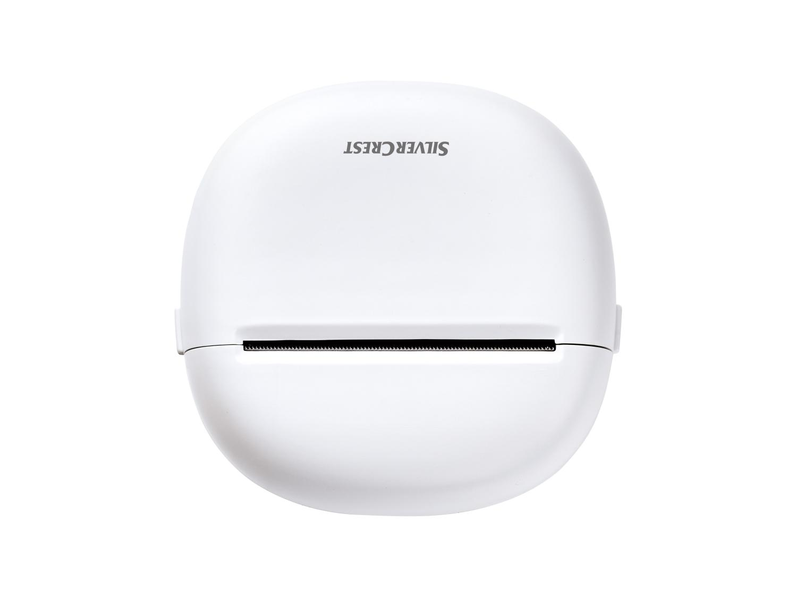
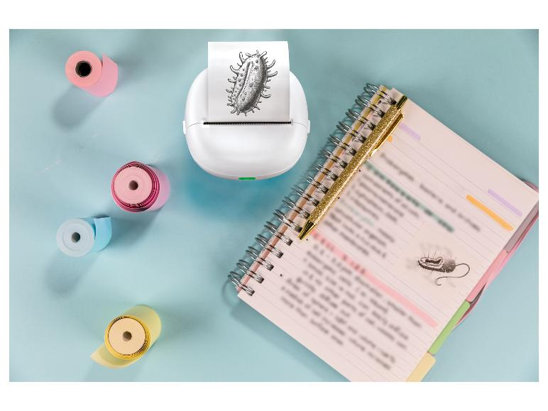

# PocketPrinter5890

*[Version française](README_FR.md)*

Swift library for driving over Bluetooth Low Energy the thermal pocket
printers sold by Lidl under the **Tronic**, **SILVERCREST** and **Parkside**
brands, without the official app and without any cloud service.

The protocol was established by reverse engineering: analysis of the BLE
frames exchanged with the device, then decompilation of the official
`com.printer.lidloffice` application, which embeds the **LuckPrinter SDK**.

| TRONIC | SILVERCREST |
|---|---|
|  |  |

The two brands ship the same hardware, the same firmware and the same
official application: only the logo on the lid differs.

## Target hardware

Markings found on the device label:

```text
TRONIC
IAN 508705_2507
Article Name : Mini Pocket Printer
Model        : 5890
Battery      : 18500 Lithium Battery 3.7V 1200mAh 4.44Wh
Input        : USB-C; 5V = 1A
EIRP         : 0.79 dBm
Frequency    : 2402-2480 MHz
Manufactured : 09-2025
```

Distributed by Karsten International, Overschiestraat 63, 1062 XD Amsterdam,
Netherlands — <info@karsten.nl> — made in China.

### Known variants

The same hardware is sold under several Lidl brands, with the same official
application:

| Brand | Lidl reference | IAN | Bluetooth | Weight |
|---|---|---|---|---|
| TRONIC | 100406318 | 508705_2507 | 5.3 | ~166 g |
| SILVERCREST | 100390313 | — | 5.0 | ~149 g |

Shared characteristics: inkless thermal printing, 203 dpi, 7.8 m roll,
1200 mAh Li-ion battery, USB-C, roughly 89 x 42 mm.



*Images: Lidl product pages.*

### Identity reported by the device

```text
Model    : A2Y        (10 FF 20 F0)
Firmware : V1.06LY    (10 FF 20 F1)
BLE name : Mini Pocket Printer_BLE
```

In the official SDK, model `A2Y` maps to the `MiniPocketPrinter` class, which
inherits from `DP_D1`.

> **This hardware is not a DP-L13.** The public documentation for the L13
> (a 14 mm label printer, 96 px raster) describes a different model. Applying
> its specifications to this device prevents printing altogether.

## Installation

```swift
dependencies: [
    .package(url: "https://github.com/<you>/PocketPrinter5890.git", from: "1.0.0")
]
```

Platforms: **macOS 10.15+**, **iOS 13+**, **iPadOS 13+**. Those floors are set
by `@Published` (Combine), which does not exist before. iPadOS builds from the
same iOS targets.

`ReceiptRenderer`, which draws receipts with AppKit, is compiled on macOS
only. Everything else — protocol, documents, barcodes, QR codes, BLE
transport — works on all three platforms.

Two products:

- `PocketPrinter5890Kit` — protocol, documents, rendering, barcodes. No
  CoreBluetooth dependency: usable with any transport.
- `PocketPrinter5890BLE` — ready-to-use CoreBluetooth transport.

## Usage

```swift
import PocketPrinter5890Kit
import PocketPrinter5890BLE

let transport = PocketPrinter5890BLE()
let printer = PocketPrinter(transport: transport)

// Device information
printer.readDeviceInformation()      // model, firmware, battery, paper
printer.setDensity(.strong)

// Composed document
var document = PrintDocument()
document.append(.title("BAKERY"))
document.append(.centered("12 Lilac Street"))
document.append(.separator(character: "-"))
document.append(.text(TextLayout.columns("2x Baguette", "2.40 EUR", width: 32)))
document.append(try PrintElement.qr("https://example.com"))
document.append(try PrintElement.code("REF12345", symbology: .ean13))
printer.print(document)
```

Printing an image (macOS):

```swift
let renderer = ReceiptRenderer(width: 384, ditherMode: .floydSteinberg)
printer.print(try renderer.bitmap(from: myImage))
```

## Protocol

### Activation sequence, mandatory

Without it the firmware acknowledges every command and **executes nothing**,
not even a paper feed. It comes from `DP_D1.printTagOnce()` in the SDK.

```text
10 FF F1 03                      enable the motor
00 x12                           wake-up (a SEPARATE command)
1F 80 <type> <len>               label length (label mode only)
1D 76 30 00 30 00 <yL> <yH> ...  raster, in bands of 24 lines
1B 4A <n>                        paper clearance
1D 0C                            positioning (label mode only)
10 FF F1 45                      end of job
```

The twelve zero bytes form a distinct command: several public write-ups
wrongly append them to `10 FF F1 03`.

### Raster

```text
Width   : 384 px = 48 bytes per line  ->  xL xH = 30 00
Encoding: 1 bit per pixel, MSB first, bit set = black dot
Bands   : 24 lines per command; a raster sent in one block is dropped
```

The print head covers 48 mm on ~56 mm paper: about 8 mm of physical margins
are expected and cannot be corrected in software.

### Encoding pitfalls

Two multi-byte commands are easy to get wrong, and both were initially
mis-ported here:

```text
10 FF 12 hi lo               auto power-off, TWO bytes, big-endian
10 FF 15 lo hi               print width, little-endian
10 FF 53 4A f + 7 bytes      clock, the header precedes the date
```

The SDK is not consistent on byte order between those two commands. A
single-byte power-off caps at 255 minutes and shifts the value; a clock
command sent without its header does nothing at all.

### Flow control

Incoming `01 nn` frames are **neither status nor acknowledgements**: they
announce that the printer can accept `nn` more packets. The SDK does
`credit.addAndGet(bArr[1] & 0xFF)` then sends up to `credit` packets in a
row. Ignoring this mechanism divides throughput by twenty.

### BLE

Service **FF00**: write to `FF02`, notifications on `FF01` and `FF03`. The
three other advertised services (Microchip Transparent UART, `18F0`,
`e781...`) accept writes but never notify.

Observed responses:

```text
FF01: 41 32 59              "A2Y"       model
FF01: 56 31 2E 30 36 4C 59  "V1.06LY"   firmware
FF01: 00 62                 98 %        battery (second byte)
FF01: 4F 4B                 "OK"        command accepted
FF03: 01 nn                             flow-control credit
```

## Firmware limitations

Established by measurement, not assumed:

| Feature | State |
|---|---|
| `ESC t` code pages | **Ignored.** Nine pages tested, nine identical unreadable lines. It even lets a stray byte print. |
| Accents, `°`, symbols | **Unsupported** in text mode: solid block. Text is transliterated to ASCII (`18°C` -> `18degC`). |
| `GS B` reverse video | Not implemented. |
| `GS ( k` QR code | **Not implemented**: prints as plain text (`k1A2k1Ck1E1k1P0...`). |
| `GS k` barcode | **Not implemented**: prints as plain text (`<I{BMETEO2026`). |

The official SDK exposes **no** text-printing function at all: the app
renders everything to a bitmap on the phone. The native text mode in this
library works but stays off the path the manufacturer took.

Practical consequence: codes are generated as images. Linear barcodes
(Code 128, Code 39, EAN-13, EAN-8) are produced in **pure Swift**, with no
system dependency; QR codes rely on CoreImage, isolated behind
`CodeBitmaps.qrMatrix` so it stays replaceable.

## Paper modes

- **Continuous paper**: no declared length, printing stops at the end of the
  content. A clearance feed (80 dots by default, ~10 mm) pushes the receipt
  clear of the print head.
- **Labels**: length declared through `1F 80`, positioning `1D 0C` between
  each one.

The SDK separates these cases with `printOnce()` and `printTagOnce()`.
Sending `1F 80` on continuous paper wastes paper.

## Repository layout

```text
Sources/PocketPrinter5890Kit/    library: protocol, documents, rendering, codes
Sources/PocketPrinter5890BLE/    CoreBluetooth transport
Sources/PocketPrinter5890Probe/  console diagnostic tool
Tests/                           89 unit tests
Examples/DemoApp/                macOS SwiftUI demonstration app
docs/PROTOCOLE.md                detailed reverse-engineering notes
```

## Console diagnostics

```bash
swift run PocketPrinter5890Probe --profile=ff00              # device info
swift run PocketPrinter5890Probe --profile=ff00 --feed-big   # paper feed
swift run PocketPrinter5890Probe --profile=ff00 --print-test # width pattern
swift run PocketPrinter5890Probe --profile=ff00 --code-pages # code page probe
```

## Tests

```bash
swift test
```

## Validation status

Confirmed on hardware: raster printing, paper feed, clearance, paper modes,
native text, QR codes and barcodes, reading model / firmware / battery /
paper, flow control.

Ported from the SDK but **untested** on this firmware, flagged in the code:
print speed, heating level, internal clock, cut marks, printer mode, factory
reset.

Deliberately not ported: firmware update (`updatePrinterLuck`). An untested
port failing mid-write would leave the printer unusable.

## To do

- **Standalone protocol document** covering every decoded frame, aimed at
  reimplementation in another language (Python, Go, Java...) without going
  through the Swift library.
- Compressed raster (`setCompress(true)` for the A2Y), to speed up large
  jobs.
- MTU negotiation up to 512 bytes; currently pinned at 180.
- Grayscale printing (`getRealGrayLevel`).
- Hardware verification of the ported but untested commands.

## Licence

Reverse engineering for interoperability, on legally acquired hardware. No
code from the official SDK is redistributed: only the protocol byte sequences
have been reimplemented.
