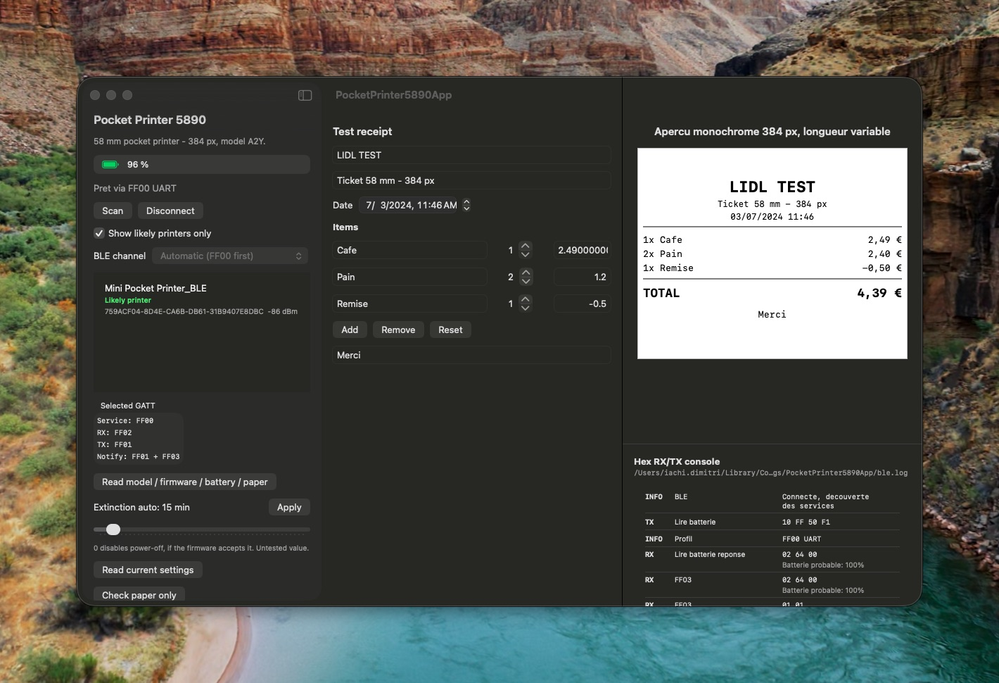

# PocketPrinter5890

*[English version](README.md)*

Librairie Swift pour piloter en Bluetooth Low Energy les mini imprimantes
thermiques de poche vendues chez Lidl sous les marques **Tronic**,
**SILVERCREST** et **Parkside**, sans passer par l'application officielle et
sans service cloud.

Le protocole a ete etabli par retro-ingenierie: analyse des trames BLE
echangees avec la machine, puis decompilation de l'application officielle
`com.printer.lidloffice`, qui embarque le **LuckPrinter SDK**.

| TRONIC | SILVERCREST |
|---|---|
|  |  |

Les deux marques couvrent le meme materiel, le meme firmware et la meme
application officielle: seul le logo sur le capot change.

## Materiel cible

References relevees sur la plaque de l'appareil:

```text
TRONIC
IAN 508705_2507
Article Name : Mini Pocket Printer
Model        : 5890
Battery      : 18500 Lithium Battery 3.7V 1200mAh 4.44Wh
Input        : USB-C; 5V = 1A
EIRP         : 0.79 dBm
Frequency    : 2402-2480 MHz
Manufactured : 09-2025
```

Distribue par Karsten International, Overschiestraat 63, 1062 XD Amsterdam,
Pays-Bas — <info@karsten.nl> — fabrique en Chine.

### Declinaisons connues

Le meme materiel est vendu sous plusieurs marques Lidl, avec la meme
application officielle:

| Marque | Reference Lidl | IAN | Bluetooth | Poids |
|---|---|---|---|---|
| TRONIC | 100406318 | 508705_2507 | 5.3 | ~166 g |
| SILVERCREST | 100390313 | — | 5.0 | ~149 g |

Caracteristiques communes: impression thermique sans encre, 203 dpi, rouleau
de 7,8 m, batterie Li-ion 1200 mAh, USB-C, dimensions ~89 x 42 mm.


*Images: fiches produit Lidl.*

### Identite retournee par la machine

```text
Modele   : A2Y        (10 FF 20 F0)
Firmware : V1.06LY    (10 FF 20 F1)
Nom BLE  : Mini Pocket Printer_BLE
```

Le modele `A2Y` correspond dans le SDK officiel a la classe
`MiniPocketPrinter`, qui herite de `DP_D1`.

> **Ce materiel n'est pas une DP-L13.** La documentation publique de la L13
> (imprimante d'etiquettes 14 mm, raster 96 px) decrit un modele different.
> Appliquer ses specifications a cette machine empeche toute impression.

## Installation

```swift
dependencies: [
    .package(url: "https://github.com/<vous>/PocketPrinter5890.git", from: "1.0.0")
]
```

Plateformes: **macOS 10.15+**, **iOS 13+**, **iPadOS 13+**. Ces planchers sont
fixes par `@Published` (Combine), qui n'existe pas avant. iPadOS se compile
depuis les memes cibles iOS.

Toute la librairie fonctionne sur les trois plateformes: protocole,
documents, rendu de ticket, codes-barres, QR codes et transport BLE.
`ReceiptRenderer` est ecrit sur CoreGraphics et CoreText plutot qu'AppKit
pour cette raison.

Deux produits:

- `PocketPrinter5890Kit` — protocole, documents, rendu, codes-barres.
  Aucune dependance a CoreBluetooth: utilisable avec n'importe quel
  transport.
- `PocketPrinter5890BLE` — transport CoreBluetooth pret a l'emploi.

## Utilisation

```swift
import PocketPrinter5890Kit
import PocketPrinter5890BLE

let transport = PocketPrinter5890BLE()
let printer = PocketPrinter(transport: transport)

// Informations
printer.readDeviceInformation()      // modele, firmware, batterie, papier
printer.setDensity(.strong)

// Document compose
var document = PrintDocument()
document.append(.title("BOULANGERIE"))
document.append(.centered("12 rue des Lilas"))
document.append(.separator(character: "-"))
document.append(.text(TextLayout.columns("2x Baguette", "2,40 EUR", width: 32)))
document.append(try PrintElement.qr("https://exemple.fr"))
document.append(try PrintElement.code("REF12345", symbology: .ean13))
printer.print(document)
```

Impression d'une image (macOS):

```swift
let renderer = ReceiptRenderer(width: 384, ditherMode: .floydSteinberg)
printer.print(try renderer.bitmap(from: monImage))
```

## Protocole

### Sequence d'activation, indispensable

Sans elle, le firmware acquitte chaque commande et **n'execute rien**, pas
meme une avance papier. Elle provient de `DP_D1.printTagOnce()` dans le SDK.

```text
10 FF F1 03                      activation du moteur
00 x12                           reveil (commande SEPAREE du enable)
1F 80 <type> <len>               longueur d'etiquette (mode etiquette seul)
1D 76 30 00 30 00 <yL> <yH> ...  raster, par bandes de 24 lignes
1B 4A <n>                        degagement papier
1D 0C                            calage (mode etiquette seul)
10 FF F1 45                      fin de travail
```

Les douze zeros forment une commande distincte: plusieurs documentations
publiques les accolent a tort a `10 FF F1 03`.

### Raster

```text
Largeur : 384 px = 48 octets par ligne  ->  xL xH = 30 00
Encodage: 1 bit par pixel, MSB first, bit a 1 = point noir
Bandes  : 24 lignes par commande; un raster envoye d'un bloc est perdu
```

La tete couvre 48 mm sur un papier de ~56 mm: environ 8 mm de marges
physiques sont normales et non corrigeables logiciellement.

### Pieges d'encodage

Deux commandes multi-octets se pretent aux erreurs, et toutes deux avaient
d'abord ete mal portees ici:

```text
10 FF 12 hi lo               extinction auto, DEUX octets, gros-boutiste
10 FF 15 lo hi               largeur d'impression, petit-boutiste
10 FF 53 4A f + 7 octets     horloge, l'en-tete precede la date
```

Le SDK n'est pas homogene sur l'ordre des octets entre ces deux commandes.
Une extinction codee sur un seul octet plafonne a 255 minutes et decale la
valeur; une commande d'horloge sans son en-tete ne produit rien.

### Controle de flux

Les trames `01 nn` recues **ne sont ni des statuts ni des acquittements**:
elles annoncent que l'imprimante peut accepter `nn` paquets supplementaires.
Le SDK fait `credit.addAndGet(bArr[1] & 0xFF)` puis envoie jusqu'a `credit`
paquets d'affilee. Ignorer ce mecanisme divise le debit par vingt.

### BLE

Service **FF00**: ecriture sur `FF02`, notifications sur `FF01` et `FF03`.
Les trois autres services annonces (Microchip Transparent UART, `18F0`,
`e781...`) acceptent l'ecriture mais ne notifient jamais.

Reponses observees:

```text
FF01: 41 32 59              "A2Y"       modele
FF01: 56 31 2E 30 36 4C 59  "V1.06LY"   firmware
FF01: 00 62                 98 %        batterie (2e octet)
FF01: 4F 4B                 "OK"        commande acceptee
FF03: 01 nn                             credit de flux
```

## Limites du firmware

Etablies experimentalement, pas supposees:

| Fonction | Etat |
|---|---|
| `ESC t` pages de code | **Ignoree.** Neuf pages testees, neuf lignes identiques et illisibles. Laisse meme un octet parasite s'imprimer. |
| Accents, `°`, symboles | **Non geres** en mode texte: carre plein. Le texte est translitere en ASCII (`18°C` -> `18degC`). |
| `GS B` inversion video | Non implementee. |
| `GS ( k` QR code | **Non implementee**: s'imprime en clair (`k1A2k1Ck1E1k1P0...`). |
| `GS k` code-barres | **Non implementee**: s'imprime en clair (`<I{BMETEO2026`). |

Le SDK officiel n'expose d'ailleurs **aucune** fonction d'impression de
texte: l'application rend tout en bitmap cote telephone. Le mode texte natif
de cette librairie fonctionne mais reste hors des sentiers battus par le
fabricant.

Consequence pratique: les codes sont generes en image. Les codes-barres
lineaires (Code 128, Code 39, EAN-13, EAN-8) sont produits en **Swift pur**,
sans dependance systeme; les QR codes s'appuient sur CoreImage, isole
derriere `CodeBitmaps.qrMatrix` pour rester remplacable.

## Modes papier

- **Papier continu**: aucune longueur declaree, l'impression s'arrete a la
  fin du contenu. Une avance de degagement (80 points par defaut, ~10 mm)
  sort le ticket de sous la tete d'impression.
- **Etiquettes**: longueur declaree via `1F 80`, calage `1D 0C` entre chaque.

Le SDK distingue ces cas par `printOnce()` et `printTagOnce()`. Envoyer
`1F 80` sur du papier continu fait derouler du papier inutilement.

## Application de demonstration

`Examples/DemoApp` pilote l'imprimante depuis une fenetre macOS: decouverte
des peripheriques, details GATT, niveau de batterie, editeur de ticket avec
apercu en direct, texte natif, codes-barres, delai d'extinction automatique,
et une console hexadecimale montrant chaque trame dans les deux sens.



L'interface suit la langue du systeme (francais ou anglais) et un menu
**Langue** permet de basculer, ce qui rend les deux traductions verifiables
sans toucher aux reglages du systeme.

`Examples/DemoAppIOS` en est le pendant iOS et iPadOS, organise en cinq
onglets — connexion, ticket, impression, reglages, console — avec les memes
fonctions adaptees au tactile.

> L'application iOS compile pour appareil et simulateur, mais le simulateur
> n'a pas de Bluetooth: seul un iPhone ou un iPad reel peut dialoguer avec
> l'imprimante. L'execution sur materiel demande de choisir une equipe de
> developpement dans Xcode.

## Structure du depot

```text
Sources/PocketPrinter5890Kit/    librairie: protocole, documents, rendu, codes
Sources/PocketPrinter5890BLE/    transport CoreBluetooth
Sources/PocketPrinter5890Probe/  outil console de diagnostic
Tests/                           89 tests unitaires
Examples/DemoApp/                application macOS SwiftUI de demonstration
Examples/DemoAppIOS/             application iOS et iPadOS de demonstration
docs/PROTOCOL_SPEC.md            specification du protocole, hors langage
docs/PROTOCOLE.md                notes brutes de retro-ingenierie
```

## Diagnostic en console

```bash
swift run PocketPrinter5890Probe --profile=ff00              # infos machine
swift run PocketPrinter5890Probe --profile=ff00 --feed-big   # avance papier
swift run PocketPrinter5890Probe --profile=ff00 --print-test # mire de largeur
swift run PocketPrinter5890Probe --profile=ff00 --code-pages # test pages de code
```

## Tests

```bash
swift test
```

## Etat de validation

Confirme sur le materiel: impression raster, avance papier, degagement, modes
papier, texte natif, QR codes et codes-barres, lecture modele / firmware /
batterie / papier, controle de flux.

Portees depuis le SDK mais **non testees** sur ce firmware, signalees dans le
code: vitesse d'impression, niveau de chauffe, horloge interne, marques de
decoupe, mode d'impression, reglages d'usine.

Volontairement non portee: la mise a jour du firmware
(`updatePrinterLuck`). Un portage non teste qui echoue en cours d'ecriture
rendrait l'imprimante inutilisable.

## Reimplementer dans un autre langage

**[`docs/PROTOCOL_SPEC.md`](docs/PROTOCOL_SPEC.md)** est la specification:
independante du langage, lisible sans connaitre Swift, et suffisante pour
ecrire une implementation depuis zero. Elle porte les sequences d'octets,
l'algorithme de controle de flux, les notes de transport par plateforme
(CoreBluetooth, Web Bluetooth, Capacitor), un tableau symptome-cause et une
implementation minimale en pseudocode.

`docs/PROTOCOLE.md` conserve les notes brutes de retro-ingenierie. Il
documente, au-dela des commandes qui fonctionnent:

- **ce que le firmware n'honore pas** (`ESC t`, `GS ( k`, `GS k`, `GS B`,
  caracteres non-ASCII), avec les traces reellement obtenues sur papier;
- **les commandes portees mais jamais executees** — une vingtaine,
  transcrites du SDK sans verification materielle;
- **les pieges qui ressemblent a des bugs firmware** mais viennent de
  l'implementation (retour a la ligne, controle de flux, mode papier).

## A faire

- Raster compresse (`setCompress(true)` pour l'A2Y), pour accelerer les gros
  travaux.
- Negociation du MTU jusqu'a 512 octets; la valeur est actuellement fixee a
  180.
- Impression en niveaux de gris (`getRealGrayLevel`).
- Verification sur le materiel des commandes portees mais non testees.

## Licence

Retro-ingenierie a fin d'interoperabilite, sur du materiel acquis
legalement. Aucun code du SDK officiel n'est redistribue: seules les
sequences d'octets du protocole ont ete reimplementees.
