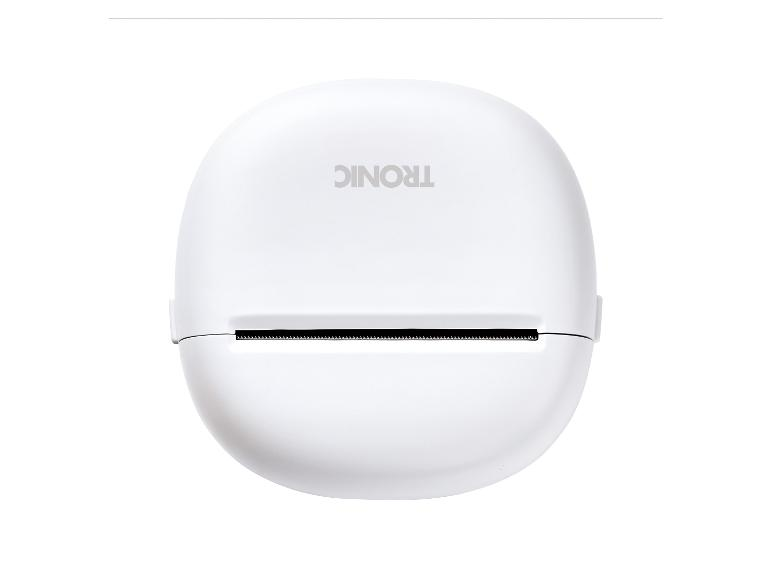

# PocketPrinter5890

*[English version](README.md)*

Piloter en Bluetooth Low Energy les mini imprimantes thermiques de poche
vendues chez Lidl sous les marques **Tronic**, **SILVERCREST** et
**Parkside** — sans l'application officielle et sans service cloud.

Le protocole a ete etabli par retro-ingenierie: analyse des trames BLE
echangees avec la machine, puis decompilation de l'application officielle
`com.printer.lidloffice`, qui embarque le LuckPrinter SDK.

| TRONIC | SILVERCREST |
|---|---|
|  |  |

Les deux marques couvrent le meme materiel, le meme firmware et la meme
application officielle: seul le logo sur le capot change.

## Contenu du depot

| Repertoire | Contenu |
|---|---|
| **[`docs/`](docs/)** | Specification du protocole — la reference, independante du langage |
| **[`swift/`](swift/)** | Librairie Swift pour macOS, iOS et iPadOS, avec deux applications de demonstration |
| **[`web/`](web/)** | Librairie TypeScript pour navigateur et Capacitor |

La specification fait foi. Les deux implementations la suivent; en cas de
divergence, c'est elle qui sert de reference pour en ecrire une troisieme.

## Par ou commencer

**Reimplementer dans un autre langage ?** Lisez
**[`docs/PROTOCOL_SPEC.md`](docs/PROTOCOL_SPEC.md)**. Le document se suffit a
lui-meme: sequences d'octets, algorithme de controle de flux, tableau
symptome-cause et implementation minimale en pseudocode. Aucune connaissance
de Swift ni de TypeScript necessaire.

**Developper une application Apple ?** Voir
[`swift/README_FR.md`](swift/README_FR.md).

**Developper pour le web ou avec Capacitor ?** Voir
[`web/README_FR.md`](web/README_FR.md).

## Le materiel

```text
TRONIC
IAN 508705_2507
Article Name : Mini Pocket Printer
Model        : 5890
Battery      : 18500 Lithium Battery 3.7V 1200mAh 4.44Wh
Input        : USB-C; 5V = 1A
Manufactured : 09-2025
```

Ce que la machine annonce en BLE: modele `A2Y`, firmware `V1.06LY`, nom
`Mini Pocket Printer_BLE`.

Largeur d'impression: **384 points** (48 octets par ligne) a 203 dpi, sur du
papier continu d'environ 56 mm.

> **Ce n'est pas une DP-L13.** La documentation largement diffusee de la L13
> decrit une imprimante d'etiquettes de 14 mm avec un raster de 96 points —
> une autre machine. Lui appliquer ces specifications empeche toute
> impression.

## Les trois obstacles d'une implementation naive

Chacun a coute du temps a identifier. C'est la raison d'etre de ce depot
plutot que d'une note rapide.

**1. Une sequence d'activation est obligatoire.** Sans `10 FF F1 03` suivi de
douze octets nuls envoyes *separement*, l'imprimante acquitte chaque commande
et n'execute rien — pas meme une avance papier.

**2. Les trames `01 nn` sont des credits de flux, pas des statuts.**
L'imprimante annonce combien de paquets elle peut accepter. Temporiser a
delai fixe divise le debit par vingt environ. Prendre une de ces trames pour
une reponse fait lire `01 01` comme « batterie: 1 % ».

**3. Le raster doit partir par bandes.** Une seule grosse commande `GS v 0`
est perdue. Decouper en bandes d'environ 24 lignes.

## Ce que le firmware ne supporte pas

Etabli par impression sur papier, pas deduit:

| Commande | Comportement |
|---|---|
| `ESC t` — page de code | Ignoree. Neuf pages testees, neuf lignes identiques et illisibles. |
| Caracteres non-ASCII | Carre plein. Transliterer en ASCII. |
| `GS B` — inversion video | Aucun effet. |
| `GS ( k` — QR code | S'imprime en clair: `k1A2k1Ck1E1k1P0...` |
| `GS k` — code-barres | S'imprime en clair: `<I{BMETEO2026` |

Les codes doivent donc etre rasterises. L'application officielle procede de
meme: son SDK n'expose aucune impression de texte ni de code, uniquement des
bitmaps.

## Etat

| | Swift | TypeScript |
|---|---|---|
| Protocole, raster, ESC/POS | ✅ | ✅ |
| Codes-barres (Code 128/39, EAN-13/8) | ✅ | ✅ |
| QR codes | ✅ CoreImage | ✅ via `qrcode-generator` |
| Rendu de ticket | ✅ CoreGraphics | ✅ Canvas |
| Parite des applications de demonstration | ✅ macOS, iOS | ✅ navigateur |
| Impression verifiee sur materiel | ✅ macOS + iPhone | ✅ Chrome |

Une vingtaine de commandes ont ete transcrites du SDK sans jamais etre
executees sur ce firmware; elles sont signalees comme telles dans les deux
implementations et dans la specification.

La mise a jour du firmware n'a volontairement pas ete implementee: un
portage non teste qui echoue en cours d'ecriture rendrait l'imprimante
inutilisable.

## Contribuer

Ce depot documente un seul exemplaire — `A2Y` / `V1.06LY`. D'autres
declinaisons de marque ou revisions de firmware peuvent se comporter
differemment. Retours utiles, par ordre d'interet:

1. Une commande non testee reellement executee sur materiel — preciser le
   modele, le firmware, la commande et le resultat.
2. Un modele different repondant autre chose a `10 FF 20 F0`.
3. Le format raster compresse: le SDK appelle `setCompress(true)` pour
   l'A2Y, ce qui suppose un encodage non documente ici.
4. Le comportement USB-C — l'imprimante reste-t-elle eveillee branchee ?

Toute correction d'une affirmation de la specification est bienvenue.
Plusieurs diagnostics initiaux se sont reveles faux et sont consignes comme
tels.

## Licence

MIT.

Retro-ingenierie a fin d'interoperabilite, sur du materiel acquis
legalement. Aucun code du fabricant n'est redistribue: seules les sequences
d'octets du protocole — des faits sur un format de communication — ont ete
documentees et reimplementees.
